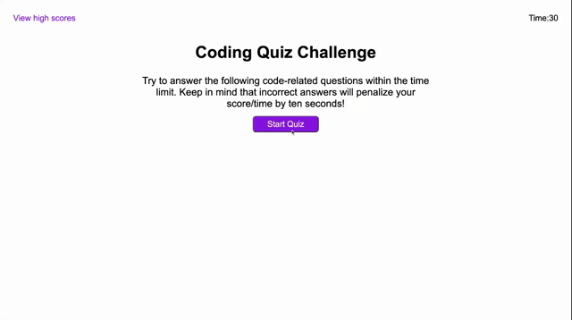

# code-quiz

## Description

Code Quiz Challenge is an application that a user can use to test their ability on JavaScript. This app will run in the browser and will feature dynamically updated HTML and powered by JavaScript code. It has a clean and polished user interface that is responsive, ensuring that it adapts to multiple screen sizes.

Here is the link to the [deployed application](https://shwethareddy0.github.io/code-quiz/)

### Features

- Fully Responsive
- Easy to modify
- Supports HTML5, CSS3 & JavaScript

## Table of Contents

- [Installation](#installation)
- [Usage](#usage)
- [Technologies Used](#technologiesused)
- [Credits](#credits)
- [License](#license)

## Installation

- Create a new repository on your GitHub account.
- Clone this repository to modify the files and images as required.
- Push your changes to your GitHub repository.
- Deploy to your preferred hosting service.

## Usage

This project can be used in any web browser or on any devices including the mobile devices.

The following image is the demo screenshot of the deployed application.



Following is a code snippet of the application page.

Here it refers to local Storage which acts as a database to store the final high scores of the users.

```html5

function readScoresFromLocalStorage() {
  var quizFinalScores = JSON.parse(localStorage.getItem("quiz-final-scores"));
  var scoreListEl = document.querySelector(".scorelist");
  scoreListEl.innerHTML = "";
  if (quizFinalScores === null) {
    return;
  } else {
    for (var i = 0; i < quizFinalScores.length; i++) {
      var scoreDiv = document.createElement("div");
      scoreDiv.textContent = quizFinalScores[i];
      scoreListEl.appendChild(scoreDiv);
    }
  }
}

```

## Technologies Used

- HTML5
- CSS3
- JavaScript
- Git
- GitHub
- GitHub Pages

## Credits

- MDN / W3Schools
- Stack Overflow

## License

This project is licensed under the [MIT](./LICENSE) license.
